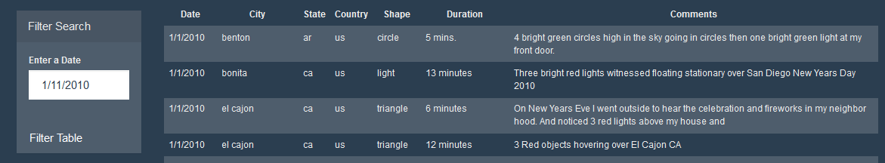
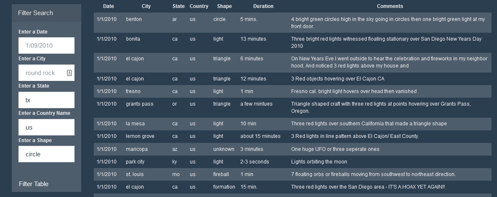

# 
  

# JavaScript and DOM Manipulation

## Background

WAKE UP SHEEPLE! The extra-terrestrial menace has come to Earth and we here at `ALIENS-R-REAL` have collected all of the eye-witness reports we could to prove it! All we need to do now is put this information online for the world to see and then the matter will finally be put to rest.

There is just one tiny problem though... our collection is too large to search through manually. Even our most dedicated followers are complaining that they are having trouble locating specific reports in this mess.

Write code that will create a dynamic table based upon a sample json dataset of UFO sitings. We also need to allow our visitors to filter the table data for specific values. Only use pure JavaScript, HTML, and CSS, and D3.js on our web pages.

## Task

### Before Beginning

1. Create a new repository for this project called `javascript-challenge`.

2. Clone the new repository to your computer.

3. Inside my local git repository, create a directory for the Javascript challenge. Use the folder names to correspond to the challenges: **UFO-level-1** and **UFO-level-2**.

4. Add my **html** files to this folder as well as a static folder containing my Javascript. This will be the main script to run for analysis.

5. Push the above changes to GitHub.

### Level 1: Automatic Table and Date Search (Required)

* Create a HTML web page.

* Using the UFO dataset provided in the form of an array of JavaScript objects, write code that appends a table to my web page and then adds new rows of data for each UFO sighting.

  * Make sure to have columns for `date/time`, `city`, `state`, `country`, `shape`, and `comment` at the very least.

* Use a date form in my HTML document and write JavaScript code that will listen for events and search through the `date/time` column to find rows that match user input.
# 
  

### Level 2: Multiple Search Categories (Optional)

* Complete all of Level 1 criteria.

* Using multiple `input` tags and/or select dropdowns, write JavaScript code so the visitor can set multiple filters and search for UFO sightings using the following criteria based on the table columns:

  1. `date/time`
  2. `city`
  3. `state`
  4. `country`
  5. `shape`
# 
  

- - -
## Tools used

* Javascript

* HTML

* CSS

* Json

* D3.js

* GitHub

## Authors

* **Michael Davis** - [Davis1776](https://github.com/Davis1776)

## Acknowledgments

* Hat tip to Triology Education Services for providing the sample data set and challenge guidelines.
* Butler University Data Analytics and Visualization Executive Education program, instructors, and teammates for assistance.